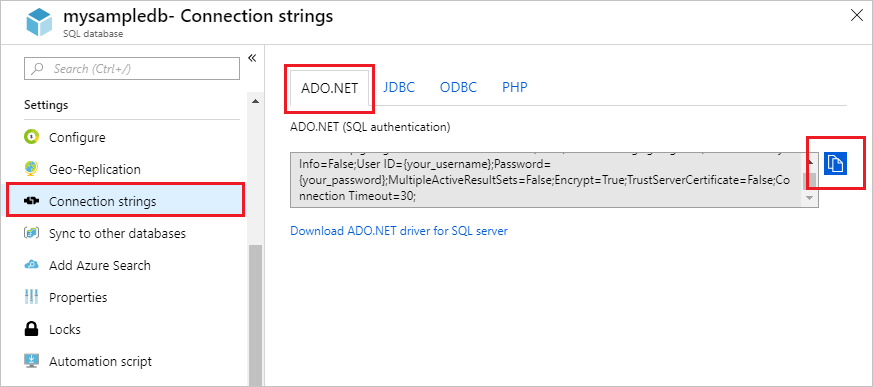
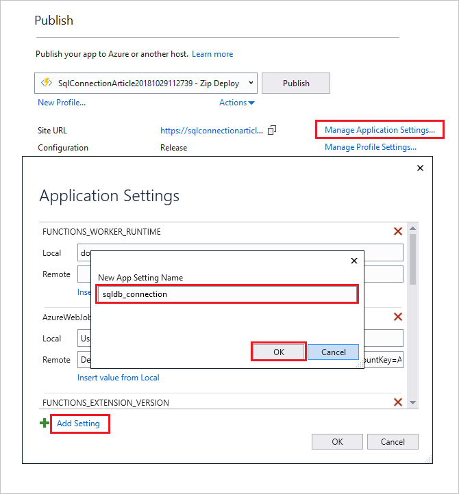
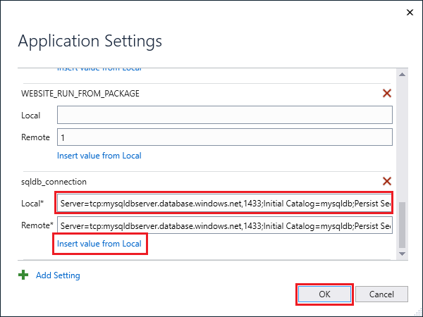
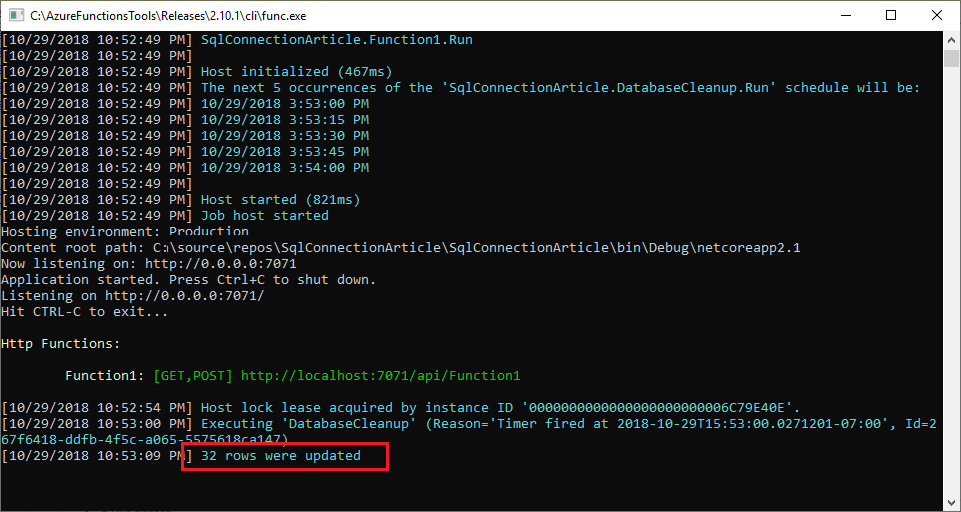

# Use Azure Functions to connect to an Azure SQL Database

This article shows you how to use Azure Functions to create a scheduled job that connects to an Azure SQL Database instance. The function code cleans up rows in a table in the database. The new C# function is created based on a pre-defined timer trigger template in Visual Studio 2019. To support this scenario, you must also set a database connection string as an app setting in the function app. This scenario uses a bulk operation against the database. 

If this is your first experience working with C# Functions, you should read the [Azure Functions C# developer reference](functions-dotnet-class-library.md).

## Prerequisites

+ Complete the steps in the article [Create your first function using Visual Studio](functions-create-your-first-function-visual-studio.md) to create a local function app that targets the version 2.x runtime. You must also have published your project to a function app in Azure.

+ This article demonstrates a Transact-SQL command that executes a bulk cleanup operation in the **SalesOrderHeader** table in the AdventureWorksLT sample database. To create the AdventureWorksLT sample database, complete the steps in the article [Create an Azure SQL database in the Azure portal](../sql-database/sql-database-get-started-portal.md).

+ You must add a [server-level firewall rule](../sql-database/sql-database-get-started-portal-firewall.md) for the public IP address of the computer you use for this quickstart. This rule is required to be able access the SQL database instance from your local computer.  

## Get connection information

You need to get the connection string for the database you created when you completed [Create an Azure SQL database in the Azure portal](../sql-database/sql-database-get-started-portal.md).

1. Sign in to the [Azure portal](https://portal.azure.com/).

1. Select **SQL Databases** from the left-hand menu, and select your database on the **SQL databases** page.

1. Select **Connection strings** under **Settings** and copy the complete **ADO.NET** connection string.

    

## Set the connection string

A function app hosts the execution of your functions in Azure. As a best security practice, store connection strings and other secrets in your function app settings. Using application settings prevents accidental disclosure of the connection string with your code. You can access app settings for your function app right from Visual Studio.

You must have previously published your app to Azure. If you haven't already done so, [Publish your function app to Azure](functions-develop-vs.md#publish-to-azure).

1. In Solution Explorer, right-click the function app project and choose **Publish** > **Manage application settings...**. Select **Add setting**, in **New app setting name**, type `sqldb_connection`, and select **OK**.

    

1. In the new **sqldb_connection** setting, paste the connection string you copied in the previous section into the **Local** field and replace `{your_username}` and `{your_password}` placeholders with real values. Select **Insert value from local** to copy the updated value into the **Remote** field, and then select **OK**.

    

    The connection strings are stored encrypted in Azure (**Remote**). To prevent leaking secrets, the local.settings.json project file (**Local**) should be excluded from source control, such as by using a .gitignore file.

## Add the SqlClient package to the project

You need to add the NuGet package that contains the SqlClient library. This data access library is needed to connect to a SQL database.

1. Open your local function app project in Visual Studio 2019.

1. In Solution Explorer, right-click the function app project and choose **Manage NuGet Packages**.

1. On the **Browse** tab, search for ```System.Data.SqlClient``` and, when found, select it.

1. In the **System.Data.SqlClient** page, select version `4.5.1` and then click **Install**.

1. When the install completes, review the changes and then click **OK** to close the **Preview** window.

1. If a **License Acceptance** window appears, click **I Accept**.

Now, you can add the C# function code that connects to your SQL Database.

## Add a timer triggered function

1. In Solution Explorer, right-click the function app project and choose **Add** > **New Azure function**.

1. With the **Azure Functions** template selected, name the new item something like `DatabaseCleanup.cs` and select **Add**.

1. In the **New Azure function** dialog box, choose **Timer trigger** and then **OK**. This dialog creates a code file for the timer triggered function.

1. Open the new code file and add the following using statements at the top of the file:

    ```cs
    using System.Data.SqlClient;
    using System.Threading.Tasks;
    ```

1. Replace the existing `Run` function with the following code:

    ```cs
    [FunctionName("DatabaseCleanup")]
    public static async Task Run([TimerTrigger("*/15 * * * * *")]TimerInfo myTimer, ILogger log)
    {
        // Get the connection string from app settings and use it to create a connection.
        var str = Environment.GetEnvironmentVariable("sqldb_connection");
        using (SqlConnection conn = new SqlConnection(str))
        {
            conn.Open();
            var text = "UPDATE SalesLT.SalesOrderHeader " +
                    "SET [Status] = 5  WHERE ShipDate < GetDate();";

            using (SqlCommand cmd = new SqlCommand(text, conn))
            {
                // Execute the command and log the # rows affected.
                var rows = await cmd.ExecuteNonQueryAsync();
                log.LogInformation($"{rows} rows were updated");
            }
        }
    }
    ```

    This function runs every 15 seconds to update the `Status` column based on the ship date. To learn more about the Timer trigger, see [Timer trigger for Azure Functions](functions-bindings-timer.md).

1. Press **F5** to start the function app. The [Azure Functions Core Tools](functions-develop-local.md) execution window opens behind Visual Studio.

1. At 15 seconds after startup, the function runs. Watch the output and note the number of rows updated in the **SalesOrderHeader** table.

    

    On the first execution, you should update 32 rows of data. Following runs update no data rows, unless you make changes to the SalesOrderHeader table data so that more rows are selected by the `UPDATE` statement.

If you plan to [publish this function](functions-develop-vs.md#publish-to-azure), remember to change the `TimerTrigger` attribute to a more reasonable [cron schedule](functions-bindings-timer.md#ncrontab-expressions) than every 15 seconds.

## Next steps

Next, learn how to use. Functions with Logic Apps to integrate with other services.

> [!div class="nextstepaction"]
> [Create a function that integrates with Logic Apps](functions-twitter-email.md)

For more information about Functions, see the following articles:

+ [Azure Functions developer reference](functions-reference.md)  
  Programmer reference for coding functions and defining triggers and bindings.
+ [Testing Azure Functions](functions-test-a-function.md)  
  Describes various tools and techniques for testing your functions.  
