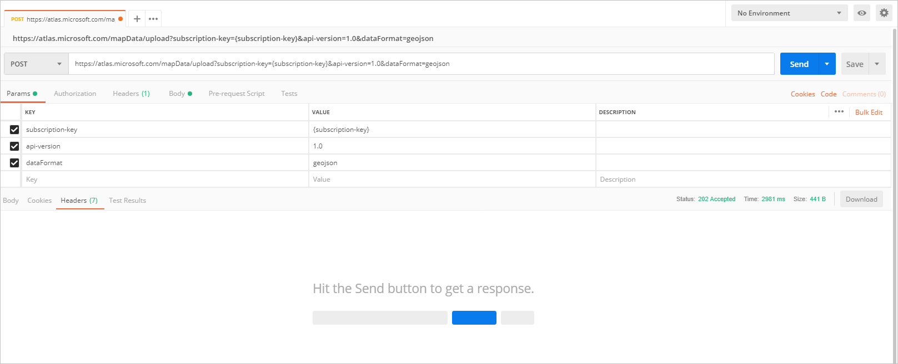
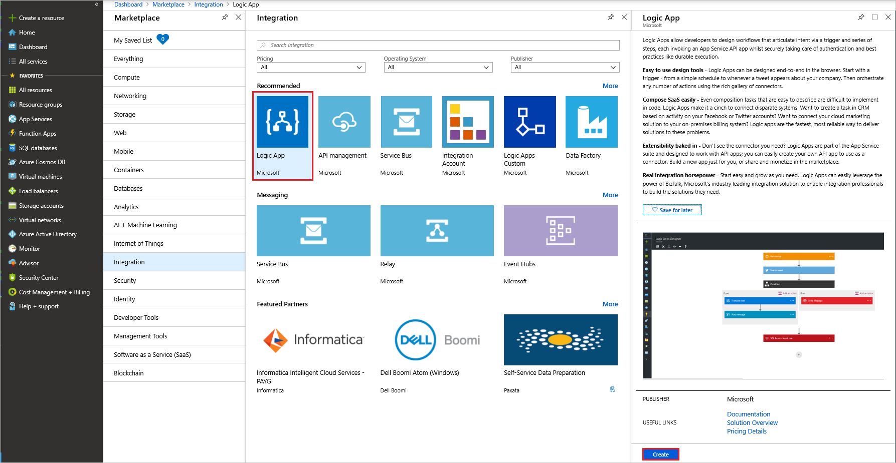
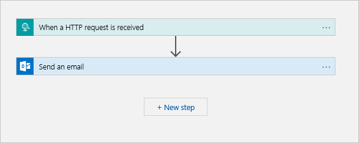
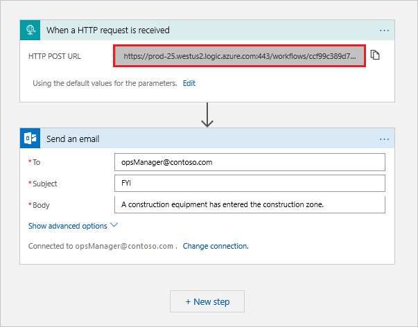
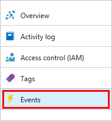
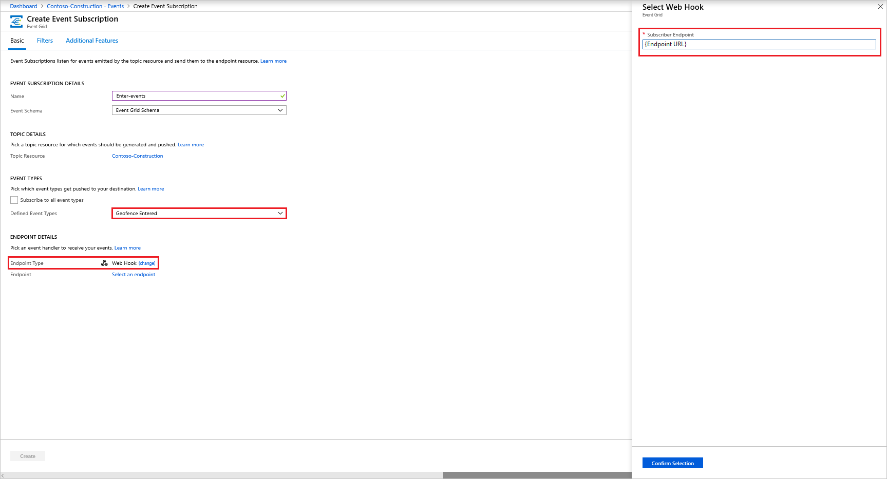
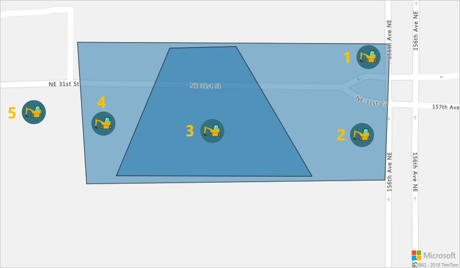
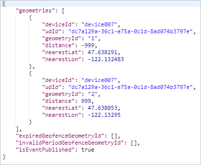
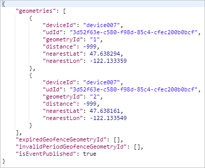
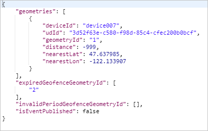

# Set up a geofence by using Azure Maps

This tutorial walks you through the basics steps to set up geofence by using Azure Maps. The scenario we address in this tutorial is help construction site managers monitor potential hazardous equipment moving beyond the designated construction areas. A construction site involves expensive equipment and regulations. It typically requires that the equipment stays inside the construction site and does not leave without permission.

We will use Azure Maps Data Upload API to store a geofence, and use Azure maps Geofence API to check the equipment location relative to the geofence. We will use Azure Event Grid to stream the geofence results and set up a notification based on the geofence results.
To learn more about Event Grid, see [Azure Event Grid](https://docs.microsoft.com/azure/event-grid/overview).
In this tutorial you will learn, how to:

> [!div class="checklist"]
> * Upload geofence area in the Azure Maps, Data service using the Data Upload API.
> *   Set up an Event Grid to handle geofence events.
> *   Setup geofence events handler.
> *   Set up alerts in response to geofence events using Logic Apps.
> *   Use Azure Maps geofence service APIs to track whether a construction asset is within the construction site or not.


## Prerequisites

### Create an Azure Maps account 

To complete the steps in this tutorial, follow instructions in [manage account](https://docs.microsoft.com/azure/azure-maps/how-to-manage-account-keys#create-a-new-account) to create an Azure Maps account subscription with S1 pricing tier and follow the steps in [get primary key](./tutorial-search-location.md#getkey) to get the primary subscription key for your account.

## Upload geofences

To upload the geofence for the construction site using the Data Upload API, we will use the postman application. For the sake of this tutorial, we assume there is an overall construction site area, which is a hard parameter that the construction equipment should not violate. Violations of this fence are a serious offense and are reported to the Operations Manager. An optimized set of additional fences can be used that track different construction areas within the overall construction area as per schedule. We can assume that the main geofence has a subsite1, which has a set expiration time and will expire after that time. You can create more nested geofences as per your requirements. For example, subsite1 could be where work is taking place during week 1 to 4 of the schedule and subsite 2 is where work takes place during week 5 to 7. All such fences can be loaded as a single dataset at the beginning of the project and used to track rules based on time and space. For more information on geofence data format, see [Geofence GeoJSON data](https://docs.microsoft.com/azure/azure-maps/geofence-geojson). For more information on uploading data to the Azure Maps service, see [Data Upload API documentation](https://docs.microsoft.com/rest/api/maps/data/uploadpreview) .

Open the Postman app and follow the following steps to upload the construction site geofence using the Azure Maps, Data Upload API.

1. Open the Postman app and click new | Create new, and select Request. Enter a Request name for Upload geofence data, select a collection or folder to save it to, and click Save.

    

2. Select POST HTTP method on the builder tab and enter the following URL to make a POST request.

    ```HTTP
    https://atlas.microsoft.com/mapData/upload?subscription-key={subscription-key}&api-version=1.0&dataFormat=geojson
    ```
    
    The GEOJSON parameter in the URL path represents the data format of the data being uploaded.

3. Click **Params**, and enter the following Key/Value pairs to be used for the POST request URL. Replace subscription-key value with your Azure Maps primary subscription key.
   
    

4. Click **Body** then select raw input format and choose JSON as the input format from the dropdown list. Provide the following JSON as data to be uploaded:

   ```JSON
   {
      "type": "FeatureCollection",
      "features": [
        {
          "type": "Feature",
          "geometry": {
            "type": "Polygon",
            "coordinates": [
              [
                [
                  -122.13393688201903,
                  47.63829579223815
                ],
                [
                  -122.13389128446579,
                  47.63782047131512
                ],
                [
                  -122.13240802288054,
                  47.63783312249837
                ],
                [
                  -122.13238388299942,
                  47.63829037035086
                ],
                [
                  -122.13393688201903,
                  47.63829579223815
                ]
              ]
            ]
          },
          "properties": {
            "geometryId": "1"
          }
        },
        {
          "type": "Feature",
          "geometry": {
            "type": "Polygon",
            "coordinates": [
              [
                [
                  -122.13374376296996,
                  47.63784758098976
                ],
                [
                  -122.13277012109755,
                  47.63784577367854
                ],
                [
                  -122.13314831256866,
                  47.6382813338708
                ],
                [
                  -122.1334782242775,
                  47.63827591198201
                ],
                [
                  -122.13374376296996,
                  47.63784758098976
                ]
              ]
            ]
          },
          "properties": {
            "geometryId": "2",
            "validityTime": {
              "expiredTime": "2019-01-15T00:00:00",
              "validityPeriod": [
                {
                  "startTime": "2019-01-08T01:00:00",
                  "endTime": "2019-01-08T17:00:00",
                  "recurrenceType": "Daily",
                  "recurrenceFrequency": 1,
                  "businessDayOnly": true
                }
              ]
            }
          }
        }
      ]
   }
   ```

5. Click send and review the response header. The location header contains the URI to access or download the data for future use. It also contains a unique `udId` for the uploaded data.

   ```HTTP
   https://atlas.microsoft.com/mapData/{udId}/status?api-version=1.0&subscription-key={Subscription-key}
   ```

## Set up an event handler

To notify the Operations Manager regarding enter and exit events, we should create an event handler that receives the notifications.

We will create two [Logic Apps](https://docs.microsoft.com/azure/event-grid/event-handlers#logic-apps) services to handle, enter, and exit events. We will also create event triggers within the Logic Apps that get triggered by these events. The idea is to send alerts, in this case emails to the Operations Manager whenever equipment enters or exits the construction site. The following figure illustrates creation of a Logic App for geofence enter event. Similarly, you can create another one for exit event.
You can see all [supported event handlers](https://docs.microsoft.com/azure/event-grid/event-handlers) for more info.

1. Create a Logic App in Azure portal

   

2. Select an HTTP request trigger and then select "send an email" as an action in the outlook connector
  
   

3. Save the logic app to generate the HTTP URL endpoint and copy the HTTP URL.

   


## Create an Azure Maps Events subscription

Azure Maps supports three event types. You can have a look at the Azure Maps supported event types [here](https://docs.microsoft.com/azure/event-grid/event-schema-azure-maps). We will create two different subscriptions, one for enter and the other for exit events.

Follow the steps below to create an event subscription for the geofence enter events. You can subscribe to geofence exit events in a similar manner.

1. Navigate to your Azure Maps account via [this portal link](https://ms.portal.azure.com/#@microsoft.onmicrosoft.com/dashboard/) and select the events Tab.

   

2. To create an event subscription, select Event Subscription from the events page.

   

3. Name the events subscription, and subscribe to the Enter event type. Now, select Web Hook as "Endpoint Type" and copy your Logic App HTTP URL endpoint into "Endpoint"

   


## Use Geofence API

You can use the Geofence API to check whether a **device** (equipment is part of status) is inside or outside a geofence. To better understand the geofence GET API. We query it against different locations where a particular equipment has moved over time. The following figure illustrates five locations of a particular construction equipment with a unique **device id** as observed in chronological order. Each of these five locations is used to assess the geofence enter and exit status change against the fence. If a state change occurs, the geofence service triggers an event, which is sent to the Logic App by the Event Grid. As a result the operation's manager will receive the corresponding enter or exit notification via an email.

> [!Note]
> The above scenario and behavior is based on the same **device id** so that it reflects the five different locations as in the figure below.



In the Postman app, open a new tab in the same collection you created above. Select GET HTTP method on the builder tab:

Following are five HTTP GET Geofencing API requests, with different corresponding location coordinates of the equipment as observed in chronological order. Each request is followed by the response body.
 
1. Location 1:
    
   ```HTTP
   https://atlas.microsoft.com/spatial/geofence/json?subscription-key={subscription-key}&api-version=1.0&deviceId=device_01&udId={udId}&lat=47.638237&lon=-122.1324831&searchBuffer=5&isAsync=True&mode=EnterAndExit
   ```
   

   If you look at the response above, the negative distance from the main geofence means that the equipment is inside the geofence and the positive from the subsite geofence means that it is outside the subsite geofence. 

2. Location 2: 
   
   ```HTTP
   https://atlas.microsoft.com/spatial/geofence/json?subscription-key={subscription-key}&api-version=1.0&deviceId=device_01&udId={udId}&lat=47.63800&lon=-122.132531&searchBuffer=5&isAsync=True&mode=EnterAndExit
   ```
    
   

   If you look at the preceding JSON response carefully the equipment is outside the subsite, but is inside the main fence. It does not trigger an event and no email is sent.

3. Location 3: 
  
   ```HTTP
   https://atlas.microsoft.com/spatial/geofence/json?subscription-key={subscription-key}&api-version=1.0&deviceId=device_01&udId={udId}&lat=47.63810783315048&lon=-122.13336020708084&searchBuffer=5&isAsync=True&mode=EnterAndExit
   ```

   

   A state change has occurred and now the equipment is within both the main and subsite geofences. This publishes an event and a notification email will be sent to the Operations Manager.

4. Location 4: 

   ```HTTP
   https://atlas.microsoft.com/spatial/geofence/json?subscription-key={subscription-key}&api-version=1.0&deviceId=device_01&udId={udId}&lat=47.637988&lon=-122.1338344&searchBuffer=5&isAsync=True&mode=EnterAndExit
   ```
  
   

   By observing the corresponding response carefully, you can note that no event gets published here even though the equipment has exited the subsite geofence. If you look at the user's specified time in the GET request, you can see that the subsite geofence has expired relative to this time and the equipment is still in the main geofence. You can also see the geometry ID of the subsite geofence under `expiredGeofenceGeometryId` in the response body.


5. Location 5:
      
   ```HTTP
   https://atlas.microsoft.com/spatial/geofence/json?subscription-key={subscription-key}&api-version=1.0&deviceId=device_01&udId={udId}&lat=47.63799&lon=-122.134505&userTime=2019-01-16&searchBuffer=5&isAsync=True&mode=EnterAndExit
   ```

   

   You can see that the equipment has left the main construction site geofence. It publishes an event, it is a serious violation, and a critical alert email is sent to the Operations Manager.

## Next steps

In this tutorial you learned, how to set up geofence by uploading it in the Azure Maps, Data service using the Data Upload API. You also learned how to use Azure Maps Events Grid to subscribe to and handle geofence events. 

* See [Handle content types in Azure Logic Apps](https://docs.microsoft.com/azure/logic-apps/logic-apps-content-type), to learn how to use Logic Apps to parse JSON to build a more complex logic.
* To know more about event handlers in Event Grid, see [supported Events Handlers in Event Grid](https://docs.microsoft.com/azure/event-grid/event-handlers).
