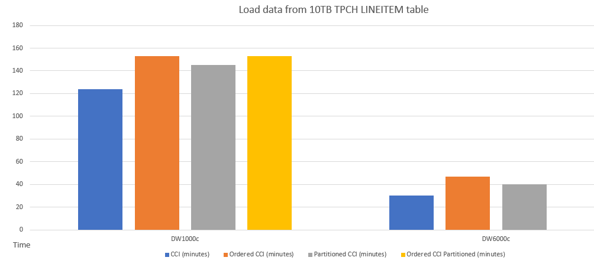

# Performance tuning with ordered clustered columnstore index  

When users query a columnstore table in Azure SQL Data Warehouse, the optimizer checks the minimum and maximum values stored in each segment.  Segments that are outside the bounds of the query predicate aren't read from disk to memory.  A query can get faster performance if the number of segments to read and their total size are small.   

## Ordered vs. non-ordered clustered columnstore index 
By default, for each Azure Data Warehouse table created without an index option, an internal component (index builder) creates a non-ordered clustered columnstore index (CCI) on it.  Data in each column is compressed into a separate CCI rowgroup segment.  There's metadata on each segment’s value range, so segments that are outside the bounds of the query predicate aren't read from disk during query execution.  CCI offers the highest level of data compression and reduces the size of segments to read so queries can run faster. However, because the index builder doesn't sort data before compressing it into segments, segments with overlapping value ranges could occur, causing queries to read more segments from disk and take longer to finish.  

When creating an ordered CCI, the Azure SQL Data Warehouse engine sorts the data in memory by the order key(s) before the index builder compresses it into index segments.  With sorted data, segment overlapping is reduced allowing queries to have a more efficient segment elimination and thus faster performance because the number of segments to read from disk is smaller.  If all data can be sorted in memory at once, then segment overlapping can be avoided.  Given the large size of data in data warehouse tables, this scenario doesn't happen often.  

To check the segment ranges for a column, run this command with your table name and column name:

```sql
SELECT o.name, pnp.index_id, pnp.rows, pnp.data_compression_desc, pnp.pdw_node_id, 
pnp.distribution_id, cls.segment_id, cls.column_id, cls.min_data_id, cls.max_data_id, cls.max_data_id-cls.min_data_id as difference
FROM sys.pdw_nodes_partitions AS pnp
   JOIN sys.pdw_nodes_tables AS Ntables ON pnp.object_id = NTables.object_id AND pnp.pdw_node_id = NTables.pdw_node_id
   JOIN sys.pdw_table_mappings AS Tmap  ON NTables.name = TMap.physical_name AND substring(TMap.physical_name,40, 10) = pnp.distribution_id
   JOIN sys.objects AS o ON TMap.object_id = o.object_id
   JOIN sys.pdw_nodes_column_store_segments AS cls ON pnp.partition_id = cls.partition_id AND pnp.distribution_id  = cls.distribution_id
   JOIN sys.columns as cols ON o.object_id = cols.object_id AND cls.column_id = cols.column_id
WHERE o.name = '<table_name>' and c.name = '<column_name>'
ORDER BY o.name, pnp.distribution_id, cls.min_data_id
```

## Data loading performance

The performance of data loading into an ordered CCI table is similar to data loading into a partitioned table.  
Loading data into an ordered CCI table can take more time than data loading into a non-ordered CCI table because of the data sorting.  

Here is an example performance comparison of loading data into tables with different schemas.

 
## Reduce segment overlapping
Below are options to further reduce segment overlapping when creating ordered CCI on a new table via CTAS or on an existing table with data:

- Use a larger resource class to allow more data to be sorted at once in memory before the index builder compresses them into segments.  Once in an index segment, the physical location of the data cannot be changed.  There is no data sorting within a segment or across segments.  

- Use a lower degree of parallelism (DOP = 1, for example).  Each thread used for ordered CCI creation works on a subset of data and sorts it locally.  There's no global  sorting across data sorted by different threads.  Using parallel threads can reduce the time to create an ordered CCI but will generate more overlapping segments than using a single thread. 
- Pre-sort the data by the sort key(s) before loading them into Azure SQL Data Warehouse tables.

## Create ordered CCI on large tables
Creating an ordered CCI is an offline operation.  For tables with no partitions, the data won't be accessible to users until the ordered CCI creation process completes.   For partitioned tables, since the engine creates the ordered CCI partition by partition, users can still access the data in partitions where ordered CCI creation isn't in process.   You can use this option to minimize the downtime during ordered CCI creation on large tables: 

1.	Create partitions on the target large table (called Table A).
2.	Create an empty ordered CCI table (called Table B) with the same table and partition schema as Table A.
3.	Switch one partition from Table A to Table B.
4.	Run ALTER INDEX <Ordered_CCI_Index> REBUILD on Table B to rebuild the switched-in partition.  
5.	Repeat step 3 and 4 for each partition in Table A.
6.	Once all partitions are switched from Table A to Table B and have been rebuilt, drop Table A, and rename Table B to Table A. 

## Examples

**A. To check for ordered columns and order ordinal:**
```sql
SELECT object_name(c.object_id) table_name, c.name column_name, i.column_store_order_ordinal 
FROM sys.index_columns i 
JOIN sys.columns c ON i.object_id = c.object_id AND c.column_id = i.column_id
WHERE column_store_order_ordinal <>0
```

**B. To change column ordinal, add or remove columns from the order list, or to change from CCI to ordered CCI:**
```sql
CREATE CLUSTERED COLUMNSTORE INDEX InternetSales ON  InternetSales
ORDER (ProductKey, SalesAmount)
WITH (DROP_EXISTING = ON)
```

## Next steps
For more development tips, see [SQL Data Warehouse development overview](sql-data-warehouse-overview-develop.md).
