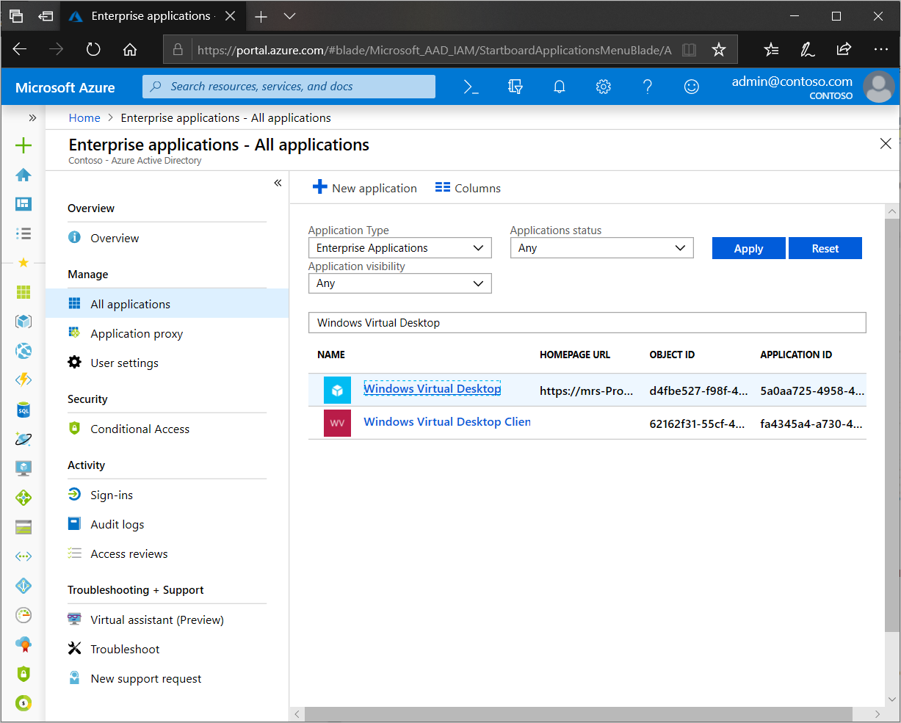
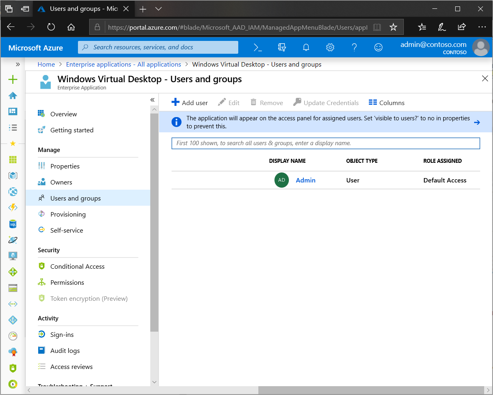
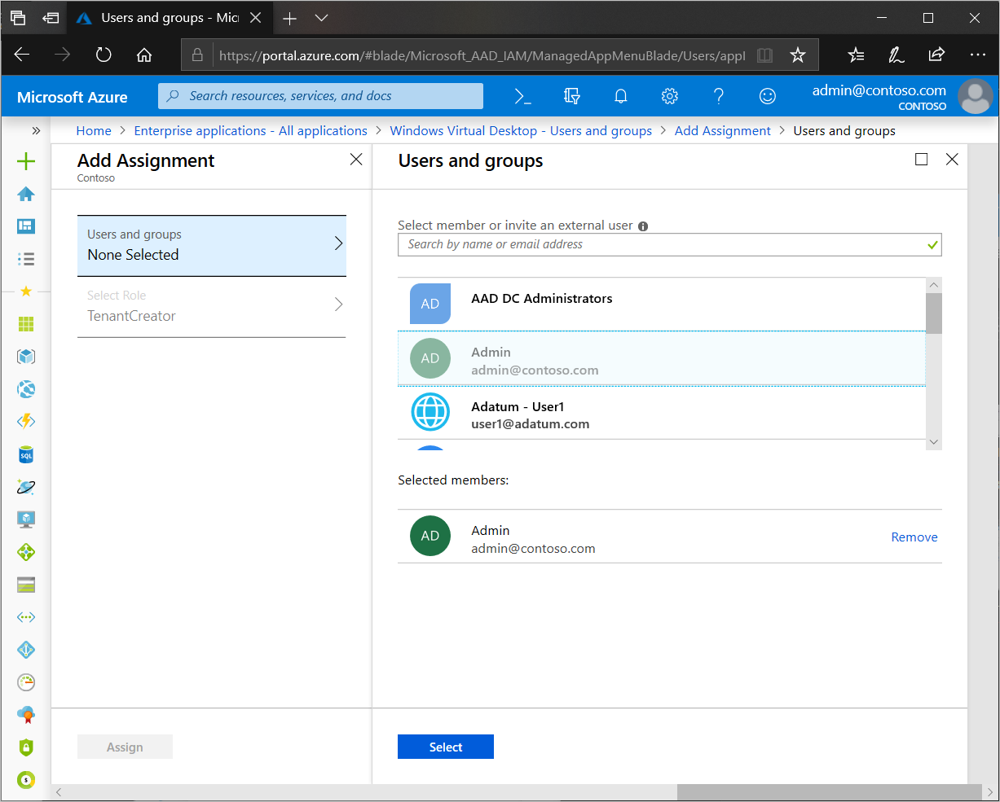
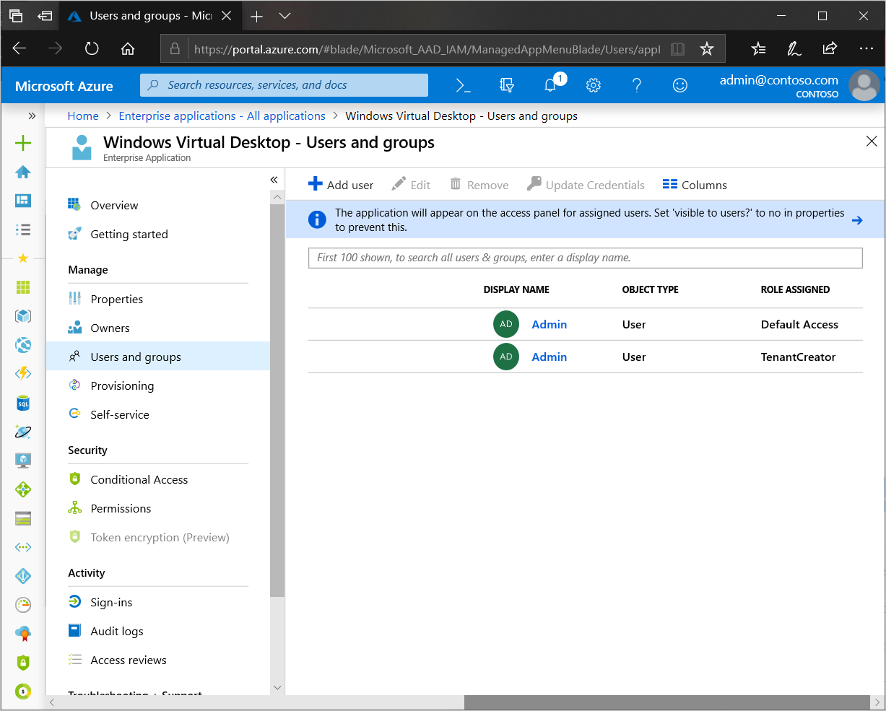
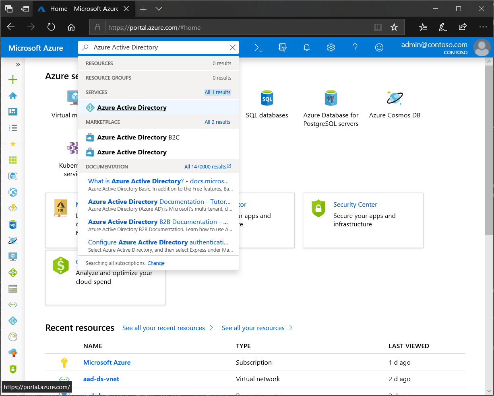
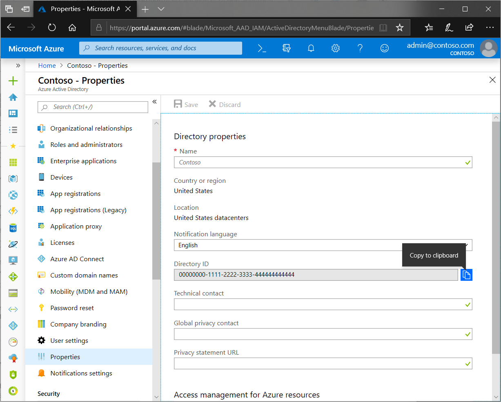
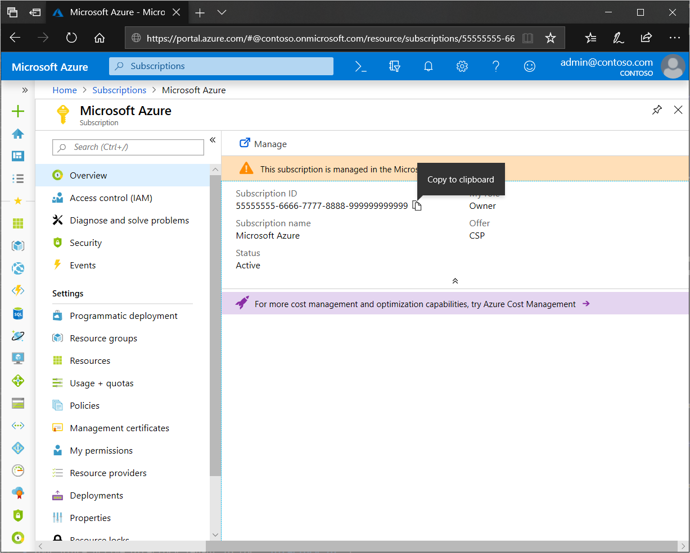

# Tutorial: Create a tenant in Windows Virtual Desktop Preview

Creating a tenant in Windows Virtual Desktop Preview is the first step toward building your desktop virtualization solution. A tenant is a group of one or more host pools. Each host pool consists of multiple session hosts, running as virtual machines in Azure and registered to the Windows Virtual Desktop service. Each host pool also consists of one or more app groups that are used to publish remote desktop and remote application resources to users. With a tenant, you can build host pools, create app groups, assign users, and make connections through the service.

In this tutorial, learn how to:

> [!div class="checklist"]
> * Grant Azure Active Directory permissions to the Windows Virtual Desktop service.
> * Assign the TenantCreator application role to a user in your Azure Active Directory tenant.
> * Create a Windows Virtual Desktop tenant.

Here's what you need to set up your Windows Virtual Desktop tenant:

* The [Azure Active Directory](https://azure.microsoft.com/services/active-directory/) tenant ID for Windows Virtual Desktop users.
* A global administrator account within the Azure Active Directory tenant.
   * This also applies to Cloud Solution Provider (CSP) organizations that are creating a Windows Virtual Desktop tenant for their customers. If you're in a CSP organization, you must be able to sign in as global administrator of the customer's Azure Active Directory instance.
   * The administrator account must be sourced from the Azure Active Directory tenant in which you're trying to create the Windows Virtual Desktop tenant. This process doesn't support Azure Active Directory B2B (guest) accounts.
   * The administrator account must be a work or school account.
* An Azure subscription.

## Grant permissions to Windows Virtual Desktop

If you have already granted permissions to Windows Virtual Desktop for this Azure Active Directory instance, skip this section.

Granting permissions to the Windows Virtual Desktop service lets it query Azure Active Directory for administrative and end-user tasks.

To grant the service permissions:

1. Open a browser and begin the admin consent flow to the [Windows Virtual Desktop server app](https://login.microsoftonline.com/common/adminconsent?client_id=5a0aa725-4958-4b0c-80a9-34562e23f3b7&redirect_uri=https%3A%2F%2Frdweb.wvd.microsoft.com%2FRDWeb%2FConsentCallback).
   > [!NOTE]
   > If you manage a customer and need to grant admin consent for the customer's directory, enter the following URL into the browser and replace {tenant} with the Azure AD domain name of the customer. For example, if the customer's organization has registered the Azure AD domain name of contoso.onmicrosoft.com, replace {tenant} with contoso.onmicrosoft.com.
   >```
   >https://login.microsoftonline.com/{tenant}/adminconsent?client_id=5a0aa725-4958-4b0c-80a9-34562e23f3b7&redirect_uri=https%3A%2F%2Frdweb.wvd.microsoft.com%2FRDWeb%2FConsentCallback
   >```

2. Sign in to the Windows Virtual Desktop consent page with a global administrator account. For example, if you were with the Contoso organization, your account might be admin@contoso.com or admin@contoso.onmicrosoft.com.
3. Select **Accept**.
4. Wait for one minute so Azure AD can record consent.
5. Open a browser and begin the admin consent flow to the [Windows Virtual Desktop client app](https://login.microsoftonline.com/common/adminconsent?client_id=fa4345a4-a730-4230-84a8-7d9651b86739&redirect_uri=https%3A%2F%2Frdweb.wvd.microsoft.com%2FRDWeb%2FConsentCallback).
   >[!NOTE]
   > If you manage a customer and need to grant admin consent for the customer's directory, enter the following URL into the browser and replace {tenant} with the Azure AD domain name of the customer. For example, if the customer's organization has registered the Azure AD domain name of contoso.onmicrosoft.com, replace {tenant} with contoso.onmicrosoft.com.
   >```
   > https://login.microsoftonline.com/{tenant}/adminconsent?client_id=fa4345a4-a730-4230-84a8-7d9651b86739&redirect_uri=https%3A%2F%2Frdweb.wvd.microsoft.com%2FRDWeb%2FConsentCallback
   >```

6. Sign in to the Windows Virtual Desktop consent page as global administrator, as you did in step 2.
7. Select **Accept**.

## Assign the TenantCreator application role

Assigning an Azure Active Directory user the TenantCreator application role allows that user to create a Windows Virtual Desktop tenant associated with the Azure Active Directory instance. You'll need to use your global administrator account to assign the TenantCreator role.

To assign the TenantCreator application role:

1. Open a browser and connect to the [Azure portal](https://portal.azure.com) with your global administrator account.
   
   If you're working with multiple Azure Active Directory tenants, it's a best practice to open a private browser session and copy and paste the URLs into the address bar.
2. In the search bar within the Azure portal, search for **Enterprise applications** and select the entry that appears under the **Services** category.
3. Within **Enterprise applications**, search for **Windows Virtual Desktop**. You'll see the two applications that you provided consent for in the previous section. Of these two apps, select **Windows Virtual Desktop**.
   
4. Select **Users and groups**. You might see that the administrator who granted consent to the application is already listed with the **Default Access** role assigned. This is not enough to create a Windows Virtual Desktop tenant. Continue following these instructions to add the **TenantCreator** role to a user.
   
5. Select **Add user**, and then select **Users and groups** in the **Add Assignment** blade.
6. Search for a user account that will create your Windows Virtual Desktop tenant. For simplicity, this can be the global administrator account.
   - If you're using a Microsoft Identity Provider like contosoadmin@live.com or contosoadmin@outlook.com, you might not be able to sign in to Windows Virtual Desktop. We recommend using a domain-specific account like admin@contoso.com or admin@contoso.onmicrosoft.com instead.

   

   > [!NOTE]
   > You must select a user (or a group that contains a user) that's sourced from this Azure Active Directory instance. You can't choose a guest (B2B) user or a service principal.

7. Select the user account, choose the **Select** button, and then select **Assign**.
8. On the **Windows Virtual Desktop - Users and groups** page, verify that you see a new entry with the **TenantCreator** role assigned to the user who will create the Windows Virtual Desktop tenant.
   

Before you continue on to create your Windows Virtual Desktop tenant, you need two pieces of information:
- Your Azure Active Directory tenant ID (or **Directory ID**)
- Your Azure subscription ID

To find your Azure Active Directory tenant ID (or **Directory ID**):
1. In the same Azure portal session, search for **Azure Active Directory** in the search bar and select the entry that appears under the **Services** category.
   
2. Scroll down until you find **Properties**, and then select it.
3. Look for **Directory ID**, and then select the clipboard icon. Paste it in a handy location so you can use it later as the **AadTenantId** value.
   

To find your Azure subscription ID:
1. In the same Azure portal session, search for **Subscriptions** in the search bar and select the entry that appears under the **Services** category.
   
2. Select the Azure subscription you want to use to receive Windows Virtual Desktop service notifications.
3. Look for **Subscription ID**, and then hover over the value until a clipboard icon appears. Select the clipboard icon and paste it in a handy location so you can use it later as the **AzureSubscriptionId** value.
   

## Create a Windows Virtual Desktop Preview tenant

Now that you've granted the Windows Virtual Desktop service permissions to query Azure Active Directory and assigned the TenantCreator role to a user account, you can create a Windows Virtual Desktop tenant.

First, [download and import the Windows Virtual Desktop module](https://docs.microsoft.com/powershell/windows-virtual-desktop/overview) to use in your PowerShell session if you haven't already.

Sign in to Windows Virtual Desktop by using the TenantCreator user account with this cmdlet:

```powershell
Add-RdsAccount -DeploymentUrl "https://rdbroker.wvd.microsoft.com"
```

After that, create a new Windows Virtual Desktop tenant associated with the Azure Active Directory tenant:

```powershell
New-RdsTenant -Name <TenantName> -AadTenantId <DirectoryID> -AzureSubscriptionId <SubscriptionID>
```

Replace the bracketed values with values relevant to your organization and tenant. The name you choose for your new Windows Virtual Desktop tenant should be globally unique. For example, let's say you're the Windows Virtual Desktop TenantCreator for the Contoso organization. The cmdlet you'd run would look like this:

```powershell
New-RdsTenant -Name Contoso -AadTenantId 00000000-1111-2222-3333-444444444444 -AzureSubscriptionId 55555555-6666-7777-8888-999999999999
```

## Next steps

After you've created your tenant, you'll need to create a service principal in Azure Active Directory and assign it a role within Windows Virtual Desktop. The service principal will allow you to successfully deploy the Windows Virtual Desktop Azure Marketplace offering to create a host pool. To learn more about host pools, continue to the tutorial for creating a host pool in Windows Virtual Desktop.

> [!div class="nextstepaction"]
> [Create service principals and role assignments with PowerShell](./create-service-principal-role-powershell.md)
