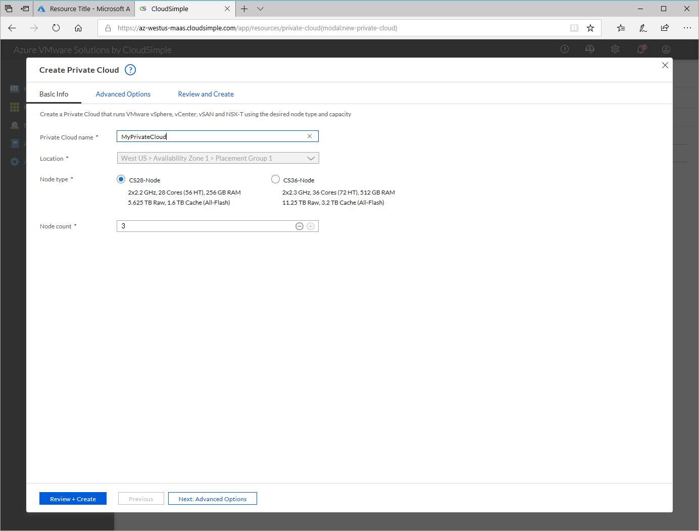

--- 
title: Azure VMware Solution by CloudSimple - Create CloudSimple Private Cloud
description: Describes how to create a CloudSimple Private Cloud to extend VMware workloads to the cloud with operational flexibility and continuity
author: sharaths-cs
ms.author: b-shsury 
ms.date: 08/19/2019 
ms.topic: article 
ms.service: azure-vmware-cloudsimple 
ms.reviewer: cynthn 
manager: dikamath 
---

# Create a CloudSimple Private Cloud

A Private Cloud is an isolated VMware stack that supports ESXi hosts, vCenter, vSAN, and NSX. Private Clouds are managed through the CloudSimple portal. They have their own vCenter server in its own management domain. The stack runs on dedicated nodes and isolated bare metal hardware nodes.

Creating a Private Cloud helps you address a variety of common needs for network infrastructure:

* **Growth**. If you've reached a hardware refresh point for your existing infrastructure, a Private Cloud allows you to expand with no new hardware investment required.

* **Fast expansion**. If any temporary or unplanned capacity needs arise, a Private Cloud allows you to create the additional capacity with no delay.

* **Increased protection**. With a Private Cloud of three or more nodes, you get automatic redundancy and high availability protection.

* **Long-term infrastructure needs**. If your datacenters are at capacity or you want to restructure to lower your costs, a Private Cloud allows you to retire datacenters and migrate to a cloud-based solution while remaining compatible with your enterprise operations.

When you create a Private Cloud, you get a single vSphere cluster and all the management VMs that are created in that cluster.

## Access the CloudSimple portal

Access the [CloudSimple portal](access-cloudsimple-portal.md).

## Create a New Private Cloud

1. Select **All services**.
2. Search for **CloudSimple Services**.
3. Select the CloudSimple service on which you want to create your Private Cloud.
4. From **Overview**, click **Create Private Cloud** to open a new browser tab for CloudSimple portal. If prompted, sign in with your Azure sign in credentials.

    

5. In the CloudSimple portal, provide a name for your Private Cloud.
6. Select **Location** for your Private Cloud.
7. Select **Node type**, consistent with what you purchased on Azure.  You can choose the [CS28 or CS36 option](cloudsimple-node.md#vmware-solution-by-cloudsimple-nodes-sku). The latter option includes the maximum compute and memory capacity.
8. Specify **Node count**.  At least three nodes are required to create a Private Cloud.

    

9. Click **Next: Advanced options**.
10. Enter the CIDR range for vSphere/vSAN subnets. Make sure that the CIDR range doesn't overlap with any of your on-premises or other Azure subnets (virtual networks) or with the gateway subnet.

    **CIDR range options:** /24, /23, /22, or /21. A /24 CIDR range supports up to nine nodes, a /23 CIDR range supports up to 41 nodes, and a /22 and /21 CIDR range supports up to 64 nodes (the maximum number of nodes in a Private Cloud).

    > [!IMPORTANT]
    > IP addresses in the vSphere/vSAN CIDR range are reserved for use by the Private Cloud infrastructure.  Don't use the IP address in this range on any virtual machine.

11. Click **Next: Review and create**.
12. Review the settings. If you need to change any settings, click **Previous**.
13. Click **Create**.

Private Cloud provisioning process starts. It can take up to two hours for the Private Cloud to be provisioned.

For instructions on expanding an existing Private Cloud, see [Expand a Private Cloud](expand-private-cloud.md).
